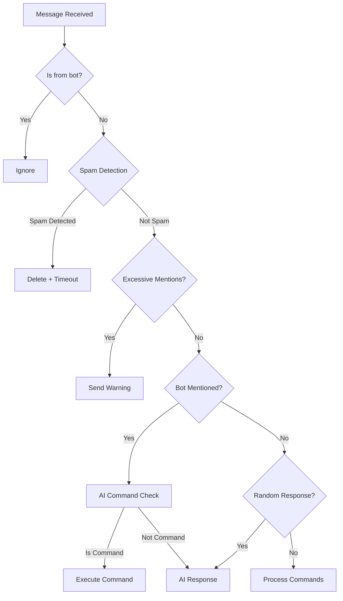
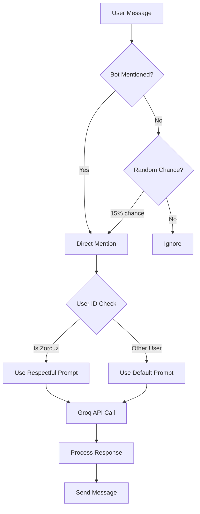

ChimBot is built using discord.py with a modular architecture separating concerns across event handlers, commands, AI integration, and moderation systems.

## Project Structure

```
Chimbot/
├── main.py           # Main bot file (830 lines)
├── .env              # Environment variables (not in repo)
├── requirements.txt  # Python dependencies
├── .gitignore        # Git ignore rules
└── img/              # Image assets
    └── image.png
```

ChimBot is intentionally a single-file application for simplicity and ease of deployment.

## Core Components

The bot is organized into several functional sections within `main.py`:

### 1. Configuration Section (Lines 1-99)

Imports, environment setup, and configuration constants:

```python main.py
# Dependencies
import discord
from discord.ext import commands, tasks
from groq import Groq
from dotenv import load_dotenv

# Bot initialization
intents = discord.Intents.default()
intents.message_content = True
intents.members = True
bot = commands.Bot(command_prefix='$', intents=intents, help_command=None)

# AI Configuration
GROQ_API_KEY = os.getenv('GROQ_API_KEY')
groq_client = Groq(api_key=GROQ_API_KEY)
PROBABILIDAD_RESPUESTA = 0.15

# Channel Configuration
CANAL_SPAM_ID = 1004171793101230151
CANAL_BIENVENIDA_ID = 1004156875035656303
```

### 2. Spam Detection System (Lines 100-208)

Functions for detecting and moderating spam:

```python main.py
def detectar_spam_rapido(user_id, timestamp):
    """Detects rapid messaging (4 messages in 4 seconds)"""
    # Implementation using sliding window algorithm
    
def detectar_spam_repetido(user_id, texto):
    """Detects repeated messages (3 identical messages)"""
    # Implementation using message history tracking
    
async def silenciar_usuario(member, duracion_segundos=10):
    """Applies timeout to spamming users"""
    # Uses Discord's timeout API
```

### 3. AI Integration (Lines 209-267)

Groq API integration for AI-powered responses:

```python main.py
async def obtener_respuesta_gemini(prompt, contexto="", user_id=None):
    """Gets AI response using Groq's LLaMA 3.3 70B model"""
    # Dual personality system
    sistema_prompt = SISTEMA_PROMPT_ZORCUZ if user_id == ZORCUZ_ID else SISTEMA_PROMPT
    
    response = groq_client.chat.completions.create(
        model="llama-3.3-70b-versatile",
        messages=[...],
        temperature=0.7,
        max_tokens=256,
    )
```

### 4. Command Interpretation (Lines 268-404)

AI-based natural language command processing:

```python main.py
async def interpretar_instruccion_ia(texto, user_id):
    """Uses AI to interpret user messages as commands"""
    # Returns: COMANDO:borrar:<qty>, COMANDO:activarspam, etc.
    
async def ejecutar_comando_ia(message, comando_str, user_id):
    """Executes commands extracted by AI"""
    # Permission checking and command execution
```

### 5. Periodic Tasks (Lines 406-425)

Background tasks for automated messaging:

```python main.py
@tasks.loop(hours=12)
async def spam_periodico():
    """Sends periodic messages to spam channel"""
    canal = bot.get_channel(CANAL_SPAM_ID)
    mensaje = obtener_mensaje_sin_repetir()
    await canal.send(mensaje)
```

### 6. Commands (Lines 427-616)

Discord command definitions using `@bot.command()` decorator:

```python main.py
@bot.command(name='help')
async def ayuda(ctx, categoria=None):
    """Multi-category help system"""

@bot.command(name='borrar')
@commands.has_permissions(manage_messages=True)
async def borrar_mensajes(ctx, cantidad: int):
    """Bulk message deletion"""
```

### 7. Event Handlers (Lines 618-826)

Core event processing for messages, member events, and errors:

```python main.py
@bot.event
async def on_message(message):
    """Main message handler - processes all messages"""
    # Spam detection
    # AI responses
    # Command processing

@bot.event
async def on_member_join(member):
    """Welcome new members with embeds"""

@bot.event
async def on_member_remove(member):
    """Farewell message for leaving members"""
```

## Data Flow

### Message Processing Flow



### AI Response Flow



## Key Design Patterns

### 1. Sliding Window for Spam Detection

```python main.py
def detectar_spam_rapido(user_id, timestamp):
    data = spam_contador[user_id]
    data['mensajes'].append(timestamp)
    
    # Clean old timestamps
    tiempo_limite = timestamp - TIEMPO_LIMITE
    data['mensajes'] = [t for t in data['mensajes'] if t > tiempo_limite]
    
    return len(data['mensajes']) >= LIMITE_MENSAJES
```

Uses a sliding window to track messages within the time limit.

### 2. Dual Personality System

```python main.py
async def obtener_respuesta_gemini(prompt, contexto="", user_id=None):
    # Switch personality based on user
    sistema_prompt = SISTEMA_PROMPT_ZORCUZ if user_id == ZORCUZ_ID else SISTEMA_PROMPT
    
    response = groq_client.chat.completions.create(
        messages=[
            {"role": "system", "content": sistema_prompt},
            {"role": "user", "content": mensaje_completo}
        ],
        # ...
    )
```

Dynamically selects AI personality based on the user ID.

### 3. Non-Repeating Message Pool

```python main.py
def obtener_mensaje_sin_repetir():
    global mensajes_disponibles
    
    if not mensajes_disponibles:
        mensajes_disponibles = mensajes_random.copy()
        random.shuffle(mensajes_disponibles)
    
    return mensajes_disponibles.pop()
```

Ensures all messages are sent before any repeat.

### 4. Dynamic Command Generation

```python main.py
def crear_comando_persona(nombre):
    async def comando(ctx):
        await ctx.send(respuestas['personas'][nombre])
    return comando

# Register all persona commands automatically
for nombre in respuestas['personas'].keys():
    bot.command(name=nombre)(crear_comando_persona(nombre))
```

Generates commands dynamically from the `respuestas` dictionary.

## State Management

ChimBot uses in-memory state with `defaultdict`:

```python main.py
# Mention tracking (resets after 60 seconds)
menciones_contador = defaultdict(lambda: {'count': 0, 'last_reset': 0})

# Spam detection (sliding window)
spam_contador = defaultdict(lambda: {'mensajes': [], 'ultimos_textos': []})

# AI response rate limiting
ultimo_respuesta_por_canal = defaultdict(lambda: 0.0)
ultimo_respuesta_por_usuario = defaultdict(lambda: 0.0)
```

<Warning>
State is stored in memory and is lost when the bot restarts. For persistent state, you would need to add a database.
</Warning>

## Dependencies

ChimBot relies on these Python packages:

```python requirements.txt
discord.py  # Discord API wrapper
groq        # Groq AI API client
python-dotenv  # Environment variable management
```

### Installing Dependencies

```bash
pip install discord.py groq python-dotenv
```

## Extension Points

Areas designed for customization:

<CardGroup cols={2}>
  <Card title="Add New Commands" icon="plus">
    Use `@bot.command()` decorator to add new commands. See lines 427-616 for examples.
  </Card>
  
  <Card title="Customize AI Behavior" icon="brain">
    Modify `SISTEMA_PROMPT` (line 40) or add new personality profiles like `SISTEMA_PROMPT_ZORCUZ`.
  </Card>
  
  <Card title="Add Event Handlers" icon="bolt">
    Use `@bot.event` decorator for new Discord events (reactions, voice, etc.).
  </Card>
  
  <Card title="Extend Spam Detection" icon="shield">
    Add new detection patterns in the `detectar_spam_*` functions or create new ones.
  </Card>
</CardGroup>

## Performance Considerations

### Async/Await Pattern

ChimBot uses Python's async/await for non-blocking I/O:

```python
async def on_message(message):
    # Non-blocking operations
    async with message.channel.typing():
        respuesta = await obtener_respuesta_gemini(...)
        await message.reply(respuesta)
```

### Rate Limiting

Built-in rate limiting prevents API abuse:

```python main.py
# Channel-level rate limiting
MIN_SECONDS_BETWEEN_RESPONSES_CHANNEL = 45

# User-level rate limiting  
MIN_SECONDS_BETWEEN_RESPONSES_USUARIO = 20
```

### Memory Management

State dictionaries automatically clean old data:

```python main.py
# Clean timestamps older than TIEMPO_LIMITE
tiempo_limite = timestamp - TIEMPO_LIMITE
data['mensajes'] = [t for t in data['mensajes'] if t > tiempo_limite]
```

## Error Handling

ChimBot includes comprehensive error handling:

```python main.py
@bot.event
async def on_command_error(ctx, error):
    if isinstance(error, commands.CommandNotFound):
        await ctx.send("Comando no encontrado. Usa `$help` para ver los comandos disponibles.")
    elif isinstance(error, commands.MissingPermissions):
        await ctx.send("No tienes permisos para usar este comando.")
```

Per-function error handling:

```python main.py
try:
    await member.timeout(duracion, reason="Spam detectado")
    return True
except discord.Forbidden:
    print(f"No tengo permisos para silenciar a {member.name}")
    return False
```

## Next Steps

<CardGroup cols={2}>
  <Card title="Contributing Guide" icon="code-pull-request" href="/development/contributing">
    Learn how to contribute to ChimBot
  </Card>
  
  <Card title="Commands Reference" icon="terminal" href="/commands/overview">
    Complete command documentation
  </Card>
</CardGroup>
